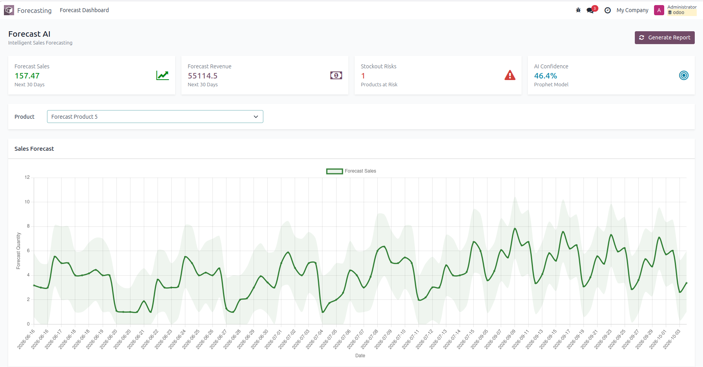

# Forecast AI

Intelligent sales forecasting for Odoo, powered by [Prophet](https://facebook.github.io/prophet/).

## Overview

`forecast_ai` analyzes historical sales orders and generates per-product
demand forecasts using Facebook's Prophet time-series model. Forecasts are
surfaced in a dashboard with key indicators and a 30-day forecast chart.

## Features

- **Automated forecast generation** — trains a Prophet model per product
  from confirmed sales order history and predicts demand for the next 30
  days.
- **Forecast Dashboard** with:
  - **Forecast Sales** — total predicted quantity for the next 30 days.
  - **Forecast Revenue** — predicted quantity × list price, next 30 days.
  - **Stockout Risks** — number of products whose predicted demand exceeds
    current available stock.
  - **AI Confidence** — an approximate confidence score derived from
    Prophet's prediction interval width.
  - A **Sales Forecast** chart (Chart.js) with a confidence band, filterable
    per product.
- **Scheduled cron** (`ir_cron_generate_product_forecast`) to refresh
  forecasts daily.
- **Manual regeneration** via the "Generate Report" button.

## Dashboard

## Access rights

| Group | Read | Write | Create | Unlink |
|---|---|---|---|---|
| Sales / User | ✔ | | | |
| Sales / Manager | ✔ | ✔ | ✔ | ✔ |

Generating a forecast (`generate_product_forecast`) is restricted to Sales
Managers (or the scheduled cron, running as superuser) since it triggers an
expensive ML training job.

## Dependencies

- `sale`
- `stock`
- [`prophet`](https://pypi.org/project/prophet/) (Python package)
- `pandas` (Python package)

## Technical notes

- Model: `sale.forecast` (`name`, `date`, `predicted_sales`, `lower_bound`,
  `upper_bound`, `product_id`).
- The forecast window is anchored on the current date (not on the last
  historical sales order date), so KPIs and the chart stay consistent even
  if the underlying sales data hasn't been updated recently.
- Products with fewer than 10 historical data points are skipped (not
  enough signal to train a meaningful model).
